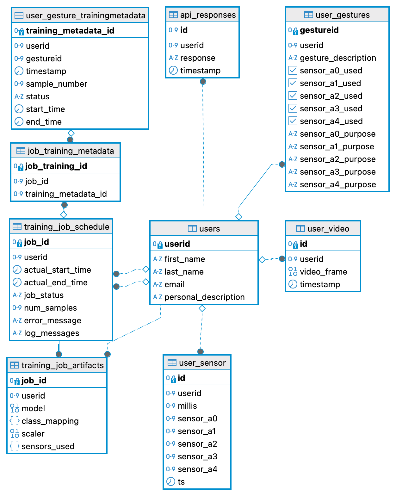

# Cloud-Based Personalized sEMG Hand Gesture Classification System

This project implements a cloud-based personalized surface electromyography (sEMG) hand gesture classification system using Convolutional Neural Networks (CNNs). The system allows each user to create a profile, define a custom gesture bank, and train a personalized CNN model that adapts to their unique muscle signal patterns. It leverages a centralized server architecture to manage data, training, and real-time inference while keeping the hardware requirements on the client side minimal.

---

## Overview

- **Personalization:** Each user’s model is trained on their own sEMG data, enabling higher accuracy by adapting to individual variations in muscle signals.
- **Cloud-Based Architecture:** All processing—including training and inference—is performed on a centralized server. This facilitates scalability and easy access to user profiles from any device.
- **Real-Time Gesture Recognition:** sEMG sensor data are collected and transmitted in real time via UDP. The system processes the data to deliver real-time gesture predictions.
- **Lightweight Models:** With a storage footprint of approximately 1 MB per model, the system is efficient and scalable.

---

## System Components

Below are the various System Components 


## Project Structure
``` text
├── README.md
├── ml_model
│   ├── TrainMLJob.py        # Script for training the CNN model
│   ├── api.py               # FastAPI application for real-time inference
│   └── nat_inference.py     # NATS-based inference module
├── streamlit_apps
│   ├── Main.py              # Main Streamlit entry point
│   └── pages
│       ├── 1_User_Management.py
│       ├── 2_Gesture_Management.py
│       ├── 3_Training_Data_Capture.py
│       ├── 4_Kickoff_Training.py
│       ├── 5_Training_Jobs_Status.py
│       ├── 6_Realtime_Gesture_Recognition.py
│       └── 7_Sensor_Data_Review.py
├── testing
│   └── udpsim.py            # UDP data simulator for testing
├── db
│   └── view_dbs.py          # Utility for viewing database details
├── udpserver
│   └── udpserver.py         # UDP server for receiving and publishing sensor data
├── tmp
│   ├── sampledataload.py    # Sample data generation and insertion script
│   ├── simulate_arduinodata.py  # Arduino data simulation script
│   └── test_inference.py    # Script for testing the inference API
├── arduino
│   └── arduinocode.ino      # Arduino sketch for sensor data transmission

```
---


### Machine Learning Modules

- **Training Module (`./ml_model/TrainMLJob.py`):**  
  Retrieves training data from a PostgreSQL database, preprocesses it (scaling, encoding, and sequence generation), trains a CNN model, and stores the resulting model artifacts (including sensor configuration and class mapping).

- **API Module (`./ml_model/api.py`):**  
  A FastAPI application that loads the latest model artifacts for each user, preprocesses incoming sensor data, and returns gesture predictions via the `/predict` endpoint.

- **NATS Inference Module (`./ml_model/nat_inference.py`):**  
  Subscribes to a NATS topic, processes batches of sensor data, and logs API responses in the database.

### User Interface and Data Management (Streamlit Apps)

- **Main App (`./streamlit_apps/Main.py`):**  
  Serves as the entry point for the web-based user interface.

- **User Management (`./streamlit_apps/pages/1_User_Management.py`):**  
  Provides functionality to create, update, or delete user profiles in the PostgreSQL database.

- **Gesture Management (`./streamlit_apps/pages/2_Gesture_Management.py`):**  
  Manages user-specific gesture definitions and sensor usage settings.

- **Training Data Capture (`./streamlit_apps/pages/3_Training_Data_Capture.py`):**  
  Captures synchronized sensor data and video streams for labeling and training.

- **Kickoff Training (`./streamlit_apps/pages/4_Kickoff_Training.py`):**  
  Allows reviewing training sessions, scheduling training jobs, and visualizing sensor data and video recordings.

- **Training Job Status (`./streamlit_apps/pages/5_Training_Jobs_Status.py`):**  
  Monitors the status, logs, and errors of ongoing training jobs.

- **Real-Time Gesture Recognition (`./streamlit_apps/pages/6_Realtime_Gesture_Recognition.py`):**  
  Displays real-time sensor data and gesture predictions.

- **Sensor Data Review (`./streamlit_apps/pages/7_Sensor_Data_Review.py`):**  
  Provides tools to review raw sensor and video data for debugging and quality control.

### Data Simulation, Testing, and Utilities

- **UDP Data Simulator (`./testing/udpsim.py`):**  
  Simulates the transmission of sEMG sensor data via UDP packets for testing purposes.

- **Database Viewer (`./db/view_dbs.py`):**  
  Inspects SQLite database files to view table schemas and sample data.

- **UDP Server (`./udpserver/udpserver.py`):**  
  Receives UDP packets, stores sensor data in PostgreSQL, and publishes messages to a NATS topic.

- **Sample Data Loader (`./testing/sampledataload.py`):**  
  Generates and inserts synthetic sensor data into the database for testing.

- **Arduino Data Simulator (`./testing/simulate_arduinodata.py`):**  
  Mimics sensor data output from an Arduino-based system.

- **Test Inference Script (`./testing/test_inference.py`):**  
  Fetches sensor data from the database in batches and sends them to the prediction API for testing.

### Shell Scripts

- **`start_all.sh`:**  
  Starts the NATS server, Streamlit app, UDP server, and ML model server (FastAPI and NATS inference) in the background, with logs saved to a dedicated logs directory.

- **`stop_all.sh`:**  
  Stops all running services (NATS server, Streamlit app, UDP server, and ML model server).

- **`requirements.txt`:**
  python requirements.txt file to install the packages.

### Database Scripts

- **`./db/postgres.sql`:**  
  Contains the PostgreSQL schema (tables for users, sensor data, gestures, training metadata, etc.) with the necessary foreign keys and constraints.


## Setup and Installation

### Prerequisites

- **Python 3.8+**
- **PostgreSQL** – To store user profiles, sensor data, training metadata, and model artifacts.
- **NATS Server** – For real-time Pub/Sub messaging.
- **Streamlit** – For the web user interface.
- **PyTorch** – For CNN model training.
- **FastAPI & Uvicorn** – For serving the inference API.
- Additional Python libraries: `pandas`, `numpy`, `scikit-learn`, `joblib`, `fire`, `psycopg2`, `uvicorn`, etc.
- **Streamlit-WebRTC** - For realtime data collection through video

### Installation Steps

1. **Clone the Repository:**
    ```bash
    git clone <repository_url>
    cd <repository_directory>
    ```

2. **Create and Activate a Virtual Environment:**
    ```bash
    python3 -m venv venv
    source venv/bin/activate  # On Windows: venv\Scripts\activate
    ```

3. **Install Required Packages:**
    ```bash
    pip install -r requirements.txt
    ```

4. **Database Setup:**
   - Create a PostgreSQL database named `sensordb`.
   - Adjust the database connection parameters in the source code files (host, database, user, and password).
   - Run the provided SQL script to set up the necessary tables:
     ```bash
     psql -U <your_username> -d sensordb -f ./db/postgres.sql
     ```
5. **Database Schema Design:**
    


### Installing and Configuring WebRTC (streamlit-webrtc)

1. **Install streamlit-webrtc:**
   - Add the following line to your `requirements.txt`:
     ```
     streamlit-webrtc
     ```
   - Then install with:
     ```bash
     pip install -r requirements.txt
     ```

2. **Install FFmpeg:**
   - **Ubuntu/Debian:**
     ```bash
     sudo apt-get update && sudo apt-get install ffmpeg
     ```
   - **macOS (Homebrew):**
     ```bash
     brew install ffmpeg
     ```
   - **Windows:**
     Download FFmpeg from [ffmpeg.org](https://ffmpeg.org/download.html) or install via Chocolatey:
     ```bash
     choco install ffmpeg
     ```

3. **Additional Configuration:**
   - For advanced configuration and troubleshooting, please follow the detailed directions at [streamlit-webrtc on GitHub](https://github.com/whitphx/streamlit-webrtc).

---
## Arduino Configuration Instructions

Follow the steps below to configure and upload the Arduino sketch to your board (e.g., an ESP32 or ESP8266 with WiFi capability).

## 1. Install the Arduino IDE
- Download and install the Arduino IDE from [arduino.cc](https://www.arduino.cc).

## 2. Connect Your Arduino Board
- Ensure your Arduino board is connected to your computer via USB.

## 3. Open the Arduino Sketch
- Open the file `arduino/arduinocode.ino` in the Arduino IDE.

## 4. Configure WiFi Credentials
- In the sketch, locate the following lines and replace the placeholders with your network credentials:

```cpp
char ssid[] = "WIFINAME";        // your network SSID (name)
char pass[] = "WIFIPASSWORD";    // your network password
```
### 5. Set the User ID

Change the `USER_ID` variable to match your testing or assigned user ID:

```cpp
int USER_ID = 21;  // Change 21 to your desired user ID
```
### 6. Configure UDP Settings

- **Local Port:**  
  The sketch uses a local port (2390) for listening; adjust it if necessary.

- **Remote Port:**  
  Set the `remotePort` variable to the port your UDP server uses (default is 8081).

- **Remote IP Address:**  
  Update the remote IP address in the `setup()` function to point to your UDP server:

  ```cpp
  remoteIp.fromString("XX.XX.XX.XX"); // Replace XX.XX.XX.XX with your UDP server's IP address
  ```
### 7. Upload the Sketch

- Select the appropriate board and COM port from the Arduino IDE.
- Click the **Upload** button to flash the code onto your Arduino board.

### 8. Verify Operation

- Open the Serial Monitor (set baud rate to 115200) to confirm that:
  - The board connects to your WiFi network.
  - Sensor data is being sent over UDP.


--- 
## Other Variables to Customize in the Code

Before running or deploying the system, review and update the following variables in the source code:

1. **Database Connection Parameters**  
   These settings appear in multiple files (e.g., `./ml_model/TrainMLJob.py`, `./ml_model/api.py`, `./udpserver/udpserver.py`, and various Streamlit pages). Update these values as follows:
   - **Host:**  
     Typically set to `localhost` if your PostgreSQL server is running locally. Otherwise, set it to your remote database host.
   - **Database:**  
     Set this to the name of your database (e.g., `sensordb`).
   - **User:**  
     Replace placeholder values (e.g., `"XXXXX"`) with your PostgreSQL username.
   - **Password:**  
     Replace placeholder values (e.g., `"XXXXX"`) with your PostgreSQL password.

2. **NATS Server Configuration**  
   In files such as `./ml_model/nat_inference.py` and `./udpserver/udpserver.py`, customize the following:
   - **NATS_SERVER:**  
     The URL of your NATS server (e.g., `nats://127.0.0.1:4222`).
   - **NATS_USER:**  
     Replace placeholder `"XXXXXXX"` with your NATS username.
   - **NATS_PASSWORD:**  
     Replace placeholder `"XXXXXXX"` with your NATS password.

3. **Project Directory**  
   In the shell scripts (`start_all.sh` and `stop_all.sh`), update the following variable:
   - **PROJECT_DIR:**  
     Set this to the absolute path of your project directory.  
     *Example:*  
     ```bash
     PROJECT_DIR=/home/yourusername/emg
     ```

4. **Port and Service Settings**  
   - **API Server Port:**  
     The FastAPI server is started on port `8000` (via uvicorn in `start_all.sh`). Ensure this port is available or change it if necessary.
   - **UDP Server Port:**  
     Typically set to `8081` in `./udpserver/udpserver.py` and referenced in testing scripts.
   - **Streamlit Default Port:**  
     By default, Streamlit runs on port `8501` unless otherwise configured.

5. **Sensor Data Simulation Settings**  
   In testing scripts (e.g., `./testing/simulate_arduinodata.py` and `./testing/udpsim.py`):
   - **DEST_IP:**  
     Set this to the IP address of your UDP server if it is not running locally.
   - **USER_ID:**  
     Ensure that the simulated sensor data uses the correct user ID for testing purposes.

Make sure to update these settings in the corresponding files before starting the system or deploying to a production environment.

-----

## Running the System by each Component

1. **Start the Inference API Server:**
    ```bash
    cd ml_model
    uvicorn api:app --host 0.0.0.0 --port 8000
    ```

2. **Launch the UDP Server:**
    ```bash
    cd udpserver
    python udpserver.py
    ```

3. **Run the Streamlit User Interface:**
    ```bash
    cd streamlit_apps
    streamlit run Main.py
    ```

4. **Simulate Sensor Data (for Testing):**
    ```bash
    cd testing
    python udpsim.py
    ```

---

## Starting and Stopping the System 

### Starting the System

To start all services, run the `start_all.sh` script from the project’s root directory. This script:

- Creates a `logs` directory (if it doesn't exist).
- Starts the **NATS server** (for real-time Pub/Sub messaging) using a config file.
- Launches the **Streamlit** user interface for managing the system.
- Starts the **UDP server** to receive sensor data.
- Launches the **ML Model Server**, which includes:
  - A FastAPI application serving the `/predict` endpoint.
  - A NATS inference process for handling sensor data batches.

**Command:**
```bash 
./start_all.sh
```

### Stopping the System

To stop all running services, run the `stop_all.sh` script. This script terminates the processes for the NATS server, Streamlit app, UDP server, and ML Model Server.

**Command:**
```bash
./stop_all.sh
```


## Training and Inference

- **Training:**  
  Initiate a training job from the "Kickoff Training" page in the Streamlit UI. The training module (`TrainMLJob.py`) will retrieve the labeled sensor data and video metadata from the database, train the CNN, and store the model artifacts.

- **Inference:**  
  The FastAPI-based inference module loads the latest model artifacts for each user and exposes a `/predict` endpoint to accept real-time sensor data. Predictions are displayed in the real-time recognition UI.

---


## Related Research

This system is based on the research paper:  
**A Cloud-Based Personalized sEMG Hand Gesture Classification System Using Convolutional Neural Networks**  
by Kaavya Tatavarty, Maxwell Johnson, and Boris Rubinsky.  

---

## Acknowledgments

 Special thanks to the University of California, Berkeley for the support provided during the development of this project and my mentor Maxwell Johnson and Professor Boris Rubinsky.

---

## License

MIT License

Copyright (c) [2023] [Kaavya Tatavarty]

Permission is hereby granted, free of charge, to any person obtaining a copy of this software and associated documentation files (the "Software"), to deal in the Software without restriction, including without limitation the rights to use, copy, modify, merge, publish, distribute, sublicense, and/or sell copies of the Software, and to permit persons to whom the Software is furnished to do so, subject to the following conditions:

The above copyright notice and this permission notice shall be included in all copies or substantial portions of the Software.

THE SOFTWARE IS PROVIDED "AS IS", WITHOUT WARRANTY OF ANY KIND, EXPRESS OR IMPLIED, INCLUDING BUT NOT LIMITED TO THE WARRANTIES OF MERCHANTABILITY, FITNESS FOR A PARTICULAR PURPOSE AND NONINFRINGEMENT. IN NO EVENT SHALL THE AUTHORS OR COPYRIGHT HOLDERS BE LIABLE FOR ANY CLAIM, DAMAGES OR OTHER LIABILITY, WHETHER IN AN ACTION OF CONTRACT, TORT OR OTHERWISE, ARISING FROM, OUT OF OR IN CONNECTION WITH THE SOFTWARE OR THE USE OR OTHER DEALINGS IN THE SOFTWARE.
**Use at your own risk. This is a research prototype provided without any warranty.**


---
## Known Issues and Limitations

**Prototype Status:**  
This system is a research prototype. Some features may be incomplete or unoptimized.

**Performance Variability:**  
Real-time performance depends on hardware and network conditions.

**Signal Variability:**  
While personalized models improve accuracy, extreme variability in sEMG signals between users may still challenge the system.

**Credential Management:**  
Some scripts may contain hard-coded credentials for testing purposes; ensure they are secured before production deployment.

## Security Considerations

**Sensitive Data:**  
Avoid hard-coding credentials in your source code. Use environment variables or secure configuration management.

**Network Security:**  
Use HTTPS and secure WebSocket connections for all remote communications.

**Database Security:**  
Restrict database access via firewalls and enforce proper user permissions.

**Data Privacy:**  
Ensure that any personally identifiable information (PII) is anonymized or encrypted in accordance with relevant data protection regulations.


## Contact

For questions or support, please raise issues.

